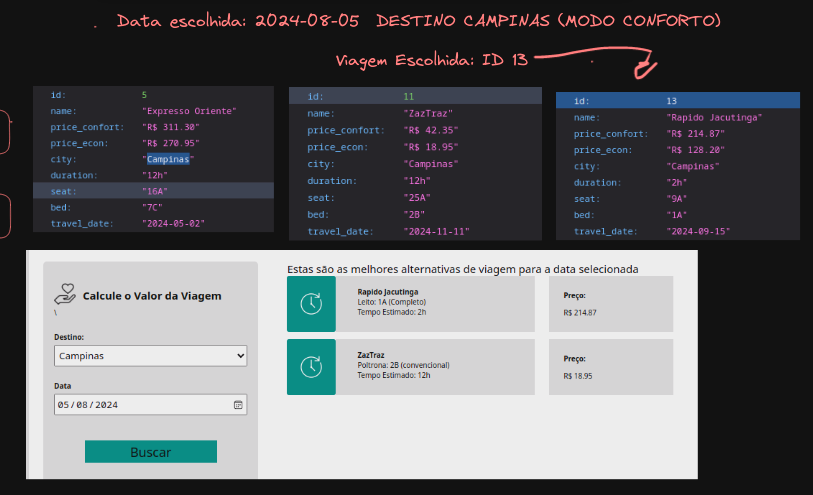
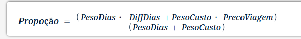

# Resultado - Desáfio CoorLab

Primeiramente, gostei muito do formato deste desafio!

Recentemente, um pouco antes deste desafio, me propus a aprender FASTAPI, apesar de já possuir conhecimento e experiência em Django. Basicamente, este desafio me proporcionou a oportunidade perfeita para colocar esse aprendizado em prática. Falando sobre o backend, adicionei mais 15 casos de viagens ao arquivo data.json, já que a quantidade anterior era muito limitada para a minha solução. Integrei uma regra de negócio que, ao lidar com viagens confortáveis ou econômicas, primeiro filtrava pelo destino escolhido e, em seguida, por um fator de proporção.

Explicando melhor, o usuário irá fornecer um destino e uma data de viagem. Meu sistema irá avaliar com base em algumas regras. Basicamente, calculei uma proporção analisando a diferença de dias entre a data fornecida pelo usuário e as datas disponíveis das viagens registradas no sistema, juntamente com o preço de cada viagem para o destino escolhido.

Então, surge a questão: qual será o peso de cada uma dessas variáveis? A data da viagem terá um peso maior? Ou seja, é preferível uma data próxima à fornecida pelo usuário, ou ele tem a opção de esperar um pouco mais para escolher uma viagem mais em conta?

À medida que essa análise se torna mais complexa, pode ser necessário recorrer ao uso de modelos de machine learning. Por isso, optei por uma abordagem mais ou menosequilibrada.

- Está procurando por uma viagem economica? então coloquei o _peso do preço para 0.7 e para a data 0.3_
  Geralmente quando vamos olhar por uma viagem pensando na economia, queremos realmente economizar, estando mais a mercer do preço das viagens.

- Está procurando conforto? Então coloquei o _peso do preço para 0.1, peso da duração para 0.7 e para a data 0.2_
  Como o requisito deixa claro que buscar por uma viagem usando o viés de conforto precisa me retornar a viagem com menor duração, coloquei o peso de duração bem maior. Não coloquei todo o peso para duração para que isso incluisse casos de empate, e pegasse o que tivesse a data(peso = 0.2) mais
  próxima da escolhida.

Assim, filtrei as viagens pelo destino escolhido pelo usuário e apliquei uma função para calcular essa proporção. Em seguida, determinei quais datas tiveram a proporção mais próxima de 0, influenciando na seleção da viagem que oferece o melhor custo-benefício.

Utilizei essa fórmula/função para calcular qual viagem resultava em um valor mais próximo de 0. Essa foi a minha lógica para a tomada de decisão em relação à escolha da viagem.

No frontend, usei Vue.js. Acrescentei algumas funcionalidades ao design fornecido, como uma Sidebar dinâmica com menu hamburguer. Além disso, minha aplicação no frontend oferece suporte responsivo para praticamente todos os tamanhos de tela.
